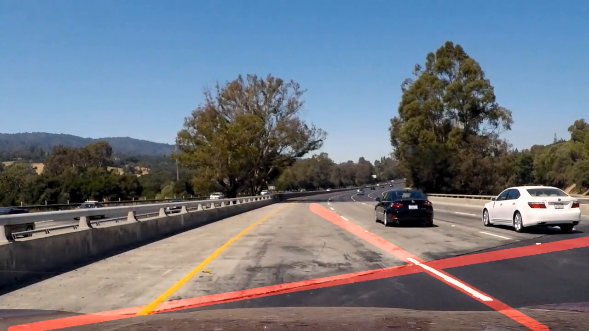

# Reflection
## 1. Pipeline Description
my pipeline consists of 6 steps:

1. Initializing the parameters (the parameters are: vertices for image, canny low and high thresholds, Gaussian Blur kernel size and hough transform parameters
2. Converting the image to grayscale image
3. Performing Guassian Blur
4. Performing Canny Edge Detection
5. Doing Hough Transform
6. Detecting the lines and drawing them on the image

The function `detect_lines` performs all the above.

## 2. Shortcomings
The method works very well on the two submission videos and most of the _challenge_ video but fails at parts of the challenge video. In particular where the road changes color and where a shadow of a tree is creating a line on the road. The method detects the shadow line and pavement color change by mistake. One improvement is to restrict the slope to be within a certain value.

An example of the detecting a pavement color change is shown here:

The method used here requires the images to be calibrated for each car. For example the challenge video required additional tuning because the aspect ratio was different and the camera was mounted different. I assume this is not a big shortcoming because it is acceptable to have each camera be calibrated to each car. However, a more general solution will figure this out automatically but is outside the scope of this project.

Another shortcoming is that I did not use temporal filtering. As a result the line bounces around to some extent. This is explained in more detail in the next section. 

## 3. Possible Improvements
One possible improvement for videos is to perform temporal filtering on the slope. In most road conditions the line does not dramatically change from one frame to the next frame. By performing temporal filtering the noise will be reduced. In addition, the line detection algorithm will become more robust to errors in 1 or 2 frames and the weight will not be entirely on a single frame.  
This method will work fine on videos but will not work on images alone and will also not work very efficiently while the filter is being initialized. One method is to use the raw signal until the filter is initialized and then use the filtered values. 

One can use a first order IIR filter with the equation:
.

Another improvement is to remove the outliers in slope. I tried calculating the mean and standard deviation and removing the points that are 2 standard deviations apart from the mean but it did not provide very good results particularly because in some of the frames only a few points were present and they were all outside 2 standard deviations of mean.
