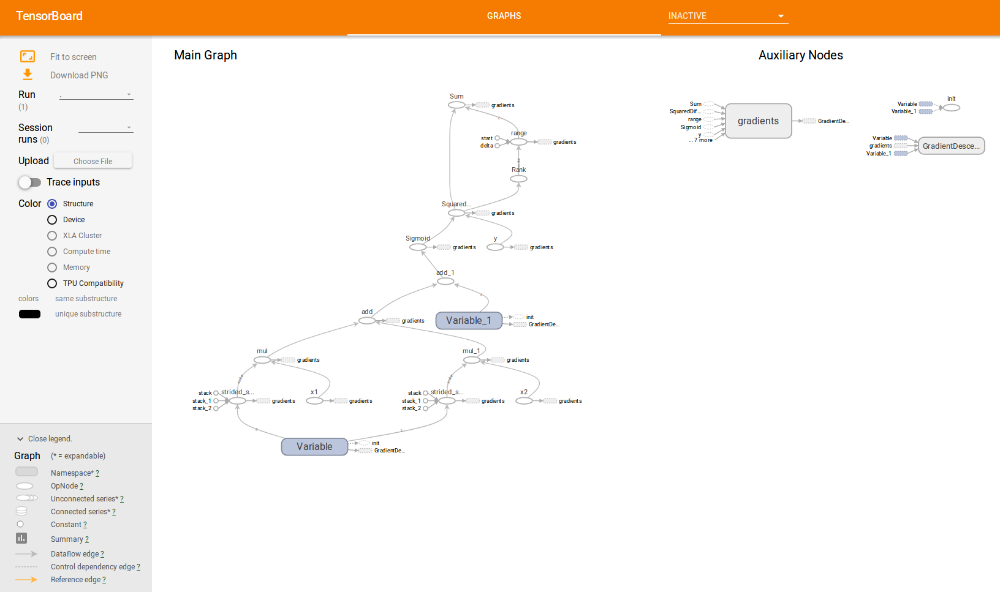
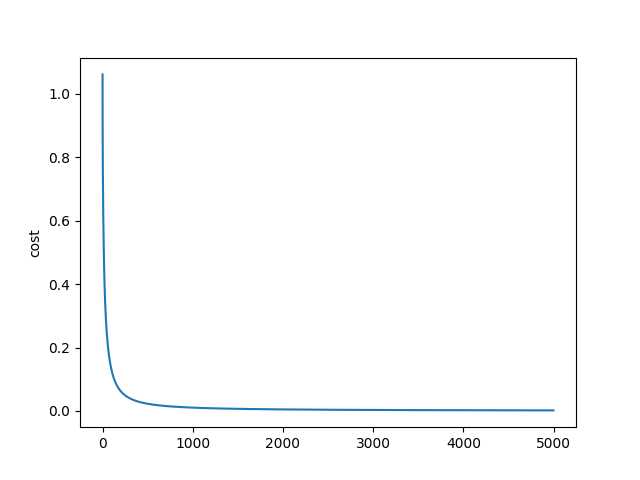

# Sandbox for tensorflow projects

## example 1
This example creates an and gate with two inputs x1 and x2 and one output. The network is sigmoid(Wx+b).

Training data is `x1: [0, 0, 1, 1], x2: [0, 1, 0, 1], y: [0, 0, 0, 1]`

It also creates a graph that you can visualize what the network is doing.
To see the graph 
1. Run the program. It generates a file in the directory of execution. 
2. Navigate to the folder and run 
`tensorboard --logdir=$PWD`
3. Open a browser and nagivate to http://localhost:6006/

It should show a graph of the network as seen below

The code also plots the loss function over epochs as shown below:

